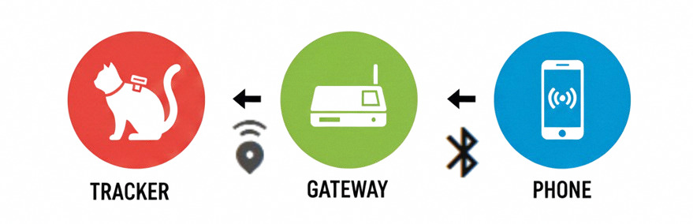
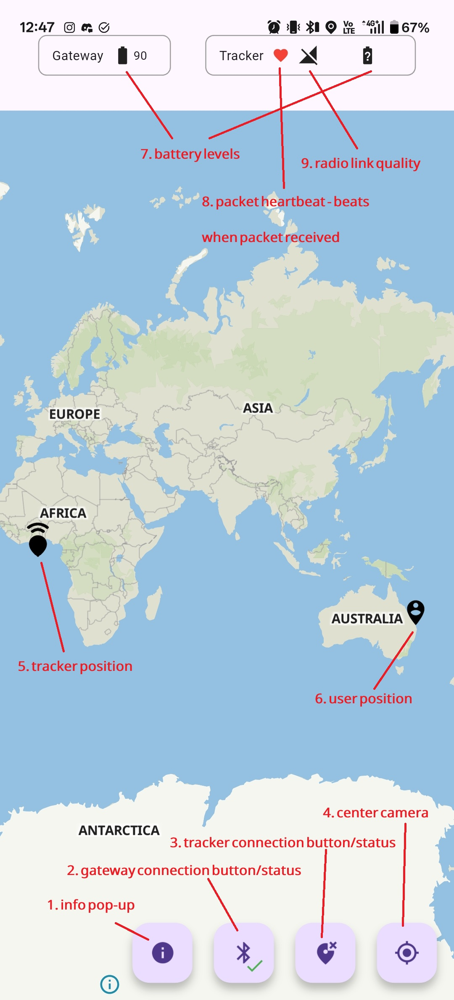
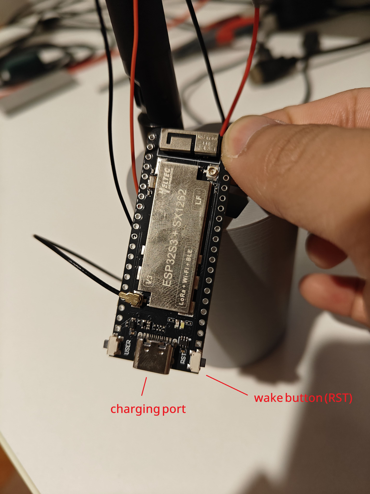
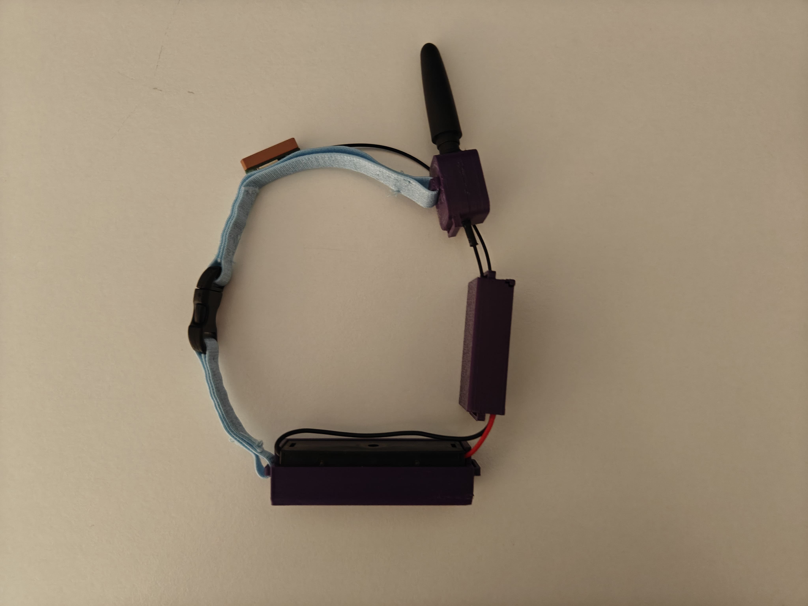
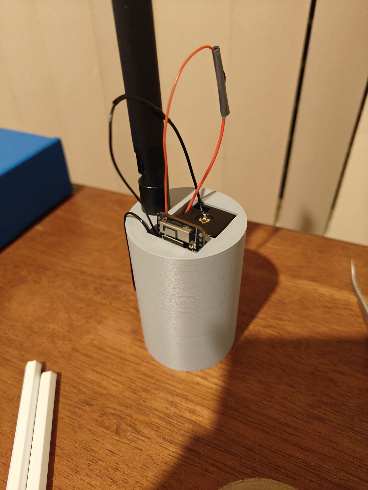

# CatLink
This is a GPS tracking solution for cats.

## Overview

There are 3 components of the CatLink system:

- Tracker (collar) - This device tracks the animal's position
- Gateway - This device manages communication with the tracker and the user's phone
- CatLink app - Displays animal position, radio link quality and other information

## Bluetooth Bonding
1. Open the app
2. When it tries to connect to the gateway, it will ask for a passkey to bond
3. Enter the number written on the gateway case
4. Close the app and open it again, the bluetooth connect button should show a green check mark

## How to use

1. Wake up the gateway using the RST button, a white LED will flash to indicate the gateway is pending connection
2. On your phone, turn on location services and open the app
3. Monitor the bluetooth button (number 2 in image), wait for a green check mark to show
4. Press the tracker connect button (number 3 in image), wait for green check mark
5. Wait for tracker position marker (number 5 in image) to update
6. Monitor heartbeat symbol (number 8 in image) to confirm tracker is communicating

## Images

### Collar

### Gateway

